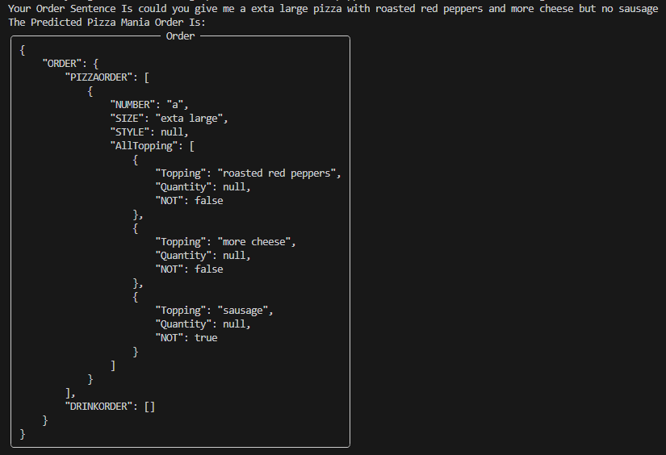

# PIZZA MANIA
## Overview
Pizza Mania is a NLP project which assign some structure form to unstructured input data which represents a pizza order.
the project comes under the semantic parsing problems where we try to assign some entity to some key features in the text such as Sizes, Toppings, Drink Types and etc.. all classes will be mentioned later on.

## Dataset Overview
for the sake of training and testing we used a dataset that was introduced by amazon science, the dataset name is <b>PIZZA - a task-oriented semantic parsing dataset</b> and you can check it out [here](https://github.com/amazon-science/pizza-semantic-parsing-dataset)

### Input Samples 
the input for our project is just a simple sentence that represents a pizza order like the following.
- let me prefer a extra large sauteed spinach and tomatoes pizza without any sausage
- could you give me a exta large pizza with roasted red peppers and more cheese but no sausage
- can you handle this order a pizza make it etra large please i want new york style tomato sauce but absolutely no onions that's important that's all
- let me try 5 lnch pizzas with garlic onions and pesto

### Output Samples
for the output we should print out some json format that represents the order in some given structure, the structure is as the following figure.

and for the given 4 sentences the output for them are as the following.

-------
## Model Architecture
a simplified overall system design for this project is something like this

the following will show a simple overview for each component

### Preprocessor
the preprocessor is the step before training and prediction, where we make some enhancement over the input data for prediction and an extra step of label extraction from the given dataset (as it is not very obvious to use and require pretty much work to parse it)

the dataset extractor component contains the following steps

### Model
the system consists of 3 models that has the same architecture but different labeling classes

the architecture of the three models is like the following

where the numbers indicates the hidden sizes of each layer

the first model is responsible of segmenting the input string into suborders, as one order may contains multiple pizza orders and/or drink orders, so it uses BIOES entity labeling to define the edges of each order

second and third models only cares of the components of each suborder type, so the pizza order only care to find the toppings, size, number of pizzas and so on while the drink order labeler only try to learn where is drink types, drink volumes, container type and so on

### Json Maker
a very simple component that takes the labeled string and convert it to the tree structure defined in the output section

## Run Guide
just run " demo.py " and it will automatically check for the libraries and prompt to install the missing libraries
- if it resulted in permission denied run the terminal as adminstrator or install the libraries defined in libraries.py manually :) 